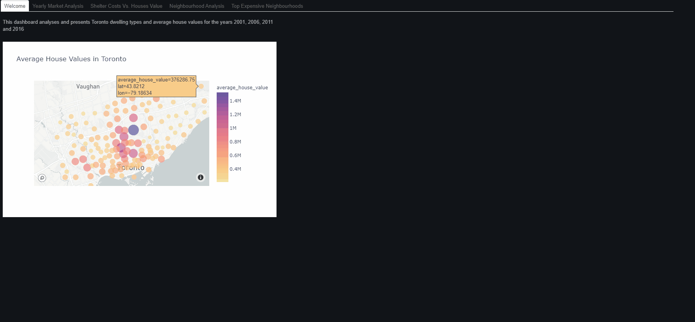
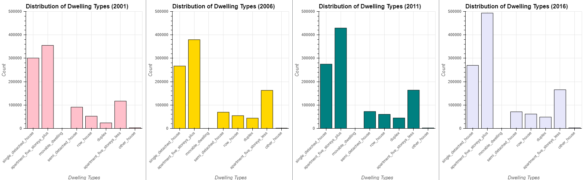
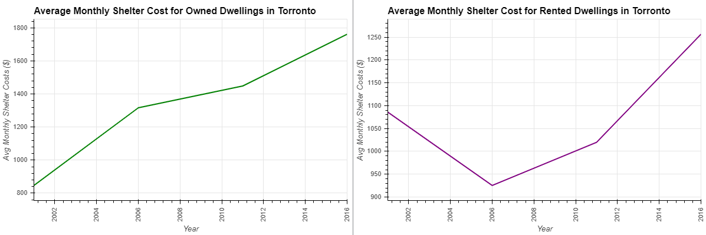
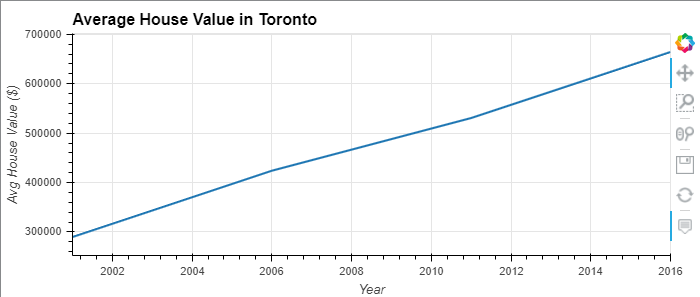
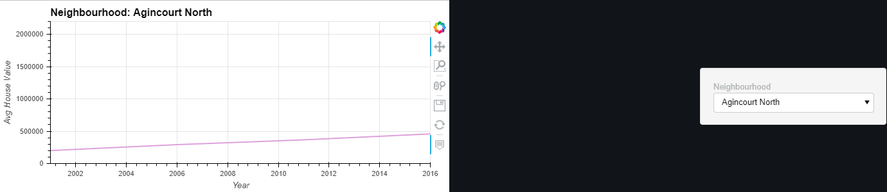
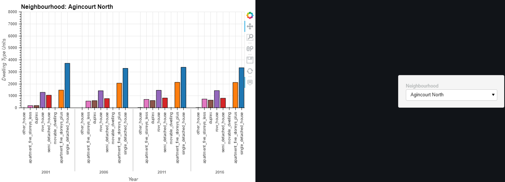
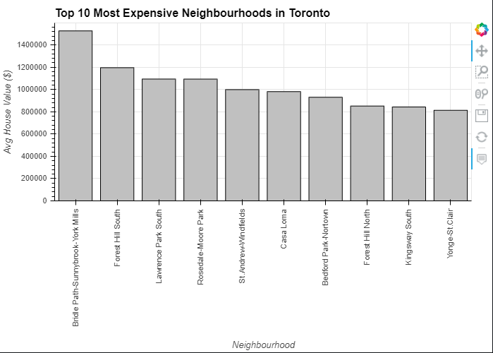
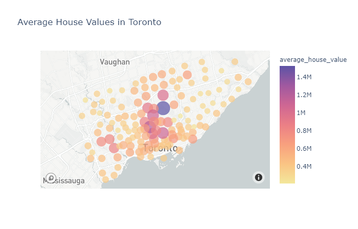
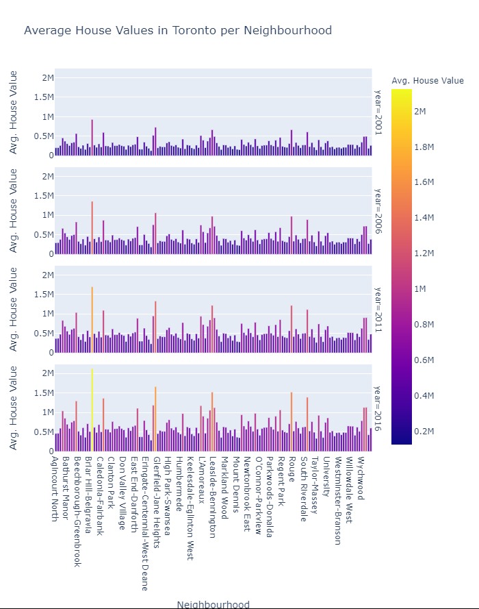
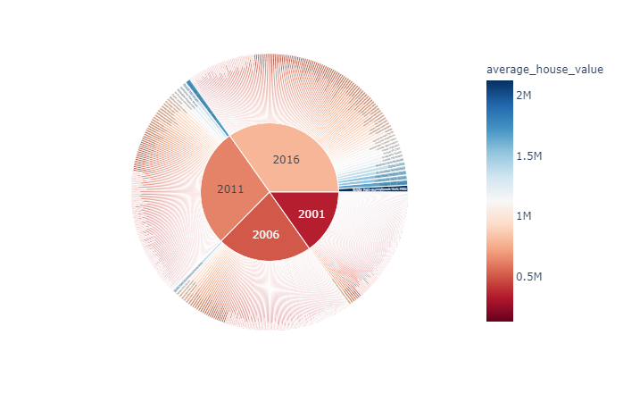

# Toronto Rental Data Dashboard
## A detailed dashboard showcasing various graphs and charts of Toronto Real Estate Data

### Types of Graphs included are as follows:
    - Distribution of dwelling types for each recorded year

    - Average monthly cost of owned and rented homes in Toronto

    - Average house value per year in Toronto

    - Average house value per year by neighbourhood

    - Average cost of dwelling types each year by neighbourhood

    - Top 10 most expensive Neighbourhoods in Toronto

    - Average house value presented on a map of Toronto

    - Average house value presented with a faceted bar chart

    - Averaged house value by neighbourhood presented with a pie chart

